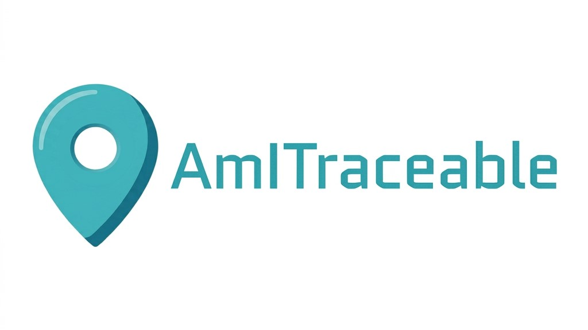

# AmITraceable — Análisis de Exposición de Identidad Digital (TFG)

<div align="center">



</div>

[](https://sonarcloud.io/summary/new_code?id=nacho50900_Echo)
[](https://sonarcloud.io/summary/new_code?id=nacho50900_Echo)
[](https://github.com/nacho50900/AmITraceable/actions/workflows/release-deploy.yml)

> Base de este proyecto: plantilla de laboratorio ASW (Uniovi) `yovi_en1b`.
> Se ha adaptado sustituyendo el dominio (usuarios/juego → análisis de
> exposición de identidad digital) y sustituyendo el servicio `users` de
> Node.js por un backend Python/FastAPI (necesario por las librerías de
> NLP: spaCy, scikit-learn, DINOv2/FAISS). El servicio `gamey` (Rust) se
> ha eliminado por no aplicar a este TFG.

TFG: análisis defensivo de la propia huella digital mediante OSINT e IA. El
usuario autentica **su propia cuenta** de Reddit y/o Instagram vía OAuth, y
la herramienta genera un informe con lo que es públicamente inferible sobre
él — para que decida qué quiere seguir compartiendo, no para vigilar a
terceros.

## Qué hace la herramienta

1. **Lee tu actividad pública** (posts/comentarios de Reddit, publicaciones
   de Instagram) tras autenticarte vía OAuth.
2. **Analiza tu forma de escribir** (huella de estilo: longitud de frase,
   vocabulario, emojis, patrón horario, idioma, keywords).
3. **Infiere atributos personales** de forma explicable (ubicación,
   ocupación, rutina) a partir de en qué comunidades/hashtags participas.
4. **Detecta declaraciones explícitas** sobre ti mismo en el texto ("tengo
   24 años", "vivo en León", "estudio Medicina"...) combinando regex
   (rápido, gratuito, determinista) con un modelo de IA (Mistral, opcional)
   que capta redacciones más libres que la regex no reconoce -- y también
   una estimación (más débil, marcada aparte) de sexo por convención
   cultural del nombre público de la cuenta. A partir de ahí, y de
   distribuciones agregadas del INE, estima **cuánta gente en España
   comparte esa combinación de características** (estilo k-anonimato:
   "solo 17 personas en España cumplen esto"), representado visualmente
   como un pictograma de monigotes (turquesa = tú, negro = el resto).
5. **Estima la ubicación de tus fotos** (solo Instagram) comparándolas por
   similitud visual (DINOv2 + FAISS) contra un índice de imágenes
   georreferenciadas de España, mostrando cada foto analizada con su
   confianza real (no solo las que superan un umbral) en un mapa y una
   lista. Las fotos cuyo pie indica que son de un viaje o vacaciones se
   detectan y se excluyen del cálculo de dónde vives habitualmente (pero
   se siguen mostrando igual en el mapa).
6. **Analiza el contenido visual de tus fotos** (solo Instagram, opcional):
   qué se ve en cada una -- objetos, actividades, aficiones, señales de
   relación de pareja -- mediante un modelo de visión-lenguaje local
   (Moondream2). A diferencia del punto anterior, esto no busca *dónde* se
   tomó la foto sino *qué hay* en ella.
7. Calcula un **score de privacidad** (0-100) con desglose por componente.
8. Envía automáticamente el informe ya generado (incluidas las
   recomendaciones por reglas fijas, como insumo) a un modelo de IA
   (Mistral AI, tier gratuito) para obtener un **veredicto general** de una
   frase y conclusiones específicas y no obvias -- sin necesidad de pulsar
   ningún botón.
9. Permite **descargar el informe completo en JSON** (portabilidad de
   datos, RGPD Art. 20).

Todo el pipeline corre **en memoria durante la petición**: no hay base de
datos, no se persiste nada del usuario más allá de la sesión de su propio
navegador.

## Estructura del proyecto

- `webapp/` — frontend React + Vite + **TypeScript**. Landing (consentimiento
  + login OAuth), Dashboard (informe completo con mapa, tablas y gráficos).
- `backend/` — backend **Python + FastAPI** (renombrado desde `users/`,
  nombre heredado de la plantilla). Aquí vive toda la lógica de OAuth, NLP,
  k-anonimato, geolocalización por imagen, scoring y el informe (ver
  `backend/app/`).
- `docs/` — documentación de arquitectura Arc42.
- `graphify-out/` — grafo de conocimiento del código, ver sección "Graphify" más abajo.

## ⚠️ Alcance y limitaciones (importante para la memoria del TFG)

- El usuario solo puede analizar **su propia cuenta autenticada**. No existe
  ningún flujo para analizar cuentas de terceros.
- **No hay base de datos.** Todo el estado vive en una cookie de sesión
  firmada (`SessionMiddleware`) con los tokens de acceso. Cerrar sesión =
  borrar todo rastro.
- La estimación de k-anonimato (`backend/app/scoring/k_anonymity.py`) usa
  **distribuciones agregadas del INE** y asume independencia entre
  atributos (no microdatos reales, no correlaciones cruzadas) — es una
  aproximación documentada, no un conteo exacto. Ver el docstring del
  módulo para la justificación de diseño frente a la alternativa
  descartada (base de datos sintética de ~49M filas).
- La geolocalización por imagen (`backend/app/vision/geolocation.py`) es
  **opcional y best-effort**: si el índice FAISS no está construido, o si
  el backend no tiene instaladas sus dependencias pesadas (`torch`,
  `faiss`, `transformers` -- ver `requirements-vision.txt` y el `ARG
  WITH_GEOLOCATION` del `Dockerfile`), esa función del pipeline
  simplemente no aporta nada, sin romper el resto del análisis. Su
  precisión realista es a nivel de provincia, no de calle (ver benchmarks
  de reverse geolocation citados en los docstrings).
- El análisis de contenido visual (`backend/app/vision/scene_analysis.py`,
  Moondream2) es igualmente **opcional y best-effort**, y depende de las
  mismas dependencias pesadas que la geolocalización (mismo
  `requirements-vision.txt`, mismo `ARG WITH_GEOLOCATION` del
  `Dockerfile`), aunque es arquitectónicamente distinto: no compara
  similitud contra un índice, sino que "interpreta" cada foto vía VQA. A
  diferencia del modelo de geolocalización, no se precarga en el arranque
  del contenedor (ver `lifespan` en `app/main.py`), así que la primera
  foto que se analiza en cada proceso es más lenta que las siguientes.
- **Exclusión de alcance deliberada: no se hace reconocimiento facial ni se
  clasifican rasgos físicos/étnicos (color de piel, pelo, ojos) de ninguna
  persona que aparezca en las fotos, incluida la propia cuenta analizada.**
  Se consideró añadirlo a `scene_analysis.py` como señal adicional para
  acotar el k-anonimato (misma lógica que ya se aplica a atributos
  autodeclarados en texto), pero se descartó por dos motivos, no solo uno:
  - **Encaja en el art. 9.1 RGPD** (categoría especial de datos: origen
    racial/étnico, datos biométricos con fin de identificación). El
    consentimiento OAuth de este proyecto cubre que el usuario analice su
    propia actividad pública, pero no constituye base legal para que el
    sistema clasifique rasgos raciales o biométricos de nadie con el fin
    de perfilar/acotar una búsqueda -- es exactamente el tipo de
    tratamiento que el RGPD trata con más cautela, no menos, y además el
    art. 4.2 define "tratamiento" de forma explícita como cualquier
    operación sobre datos personales *se persista o no el resultado*: que
    algo no se guarde no significa que no se haya procesado.
  - Determinar "cuál de las personas de la foto es el usuario" (por
    comparación con la foto de perfil o por frecuencia de aparición) exige
    procesar la cara de **todas** las personas presentes para poder
    distinguir/descartar, no solo la del usuario -- típicamente detección
    de rostro + embedding + comparación/clustering entre fotos, es decir,
    reconocimiento facial de terceros (acompañantes, amigos, desconocidos
    de fondo) que nunca dieron su consentimiento vía OAuth ni de ninguna
    otra forma. El consentimiento del titular de la cuenta no se extiende
    a las demás personas que aparecen en su contenido.
  A esto se suma, ya como razón secundaria de calidad de la señal (no de
  legalidad): los VLM son conocidos por ser poco fiables e inconsistentes
  clasificando tono de piel (varía con iluminación, balance de blancos,
  ángulo de la cámara), así que alimentar esa señal al k-anonimato daría
  una falsa sensación de precisión sobre una estimación ya de por sí poco
  fiable. El prompt de `scene_analysis.py` se mantiene deliberadamente
  acotado a objetos/escena/aficiones/indicios de pareja -- nunca a la
  descripción física de las personas que aparecen.
- Las heurísticas de inferencia de atributos
  (`backend/app/nlp/attribute_inference.py`,
  `backend/app/nlp/demographic_extraction.py`) son deliberadamente simples
  (listas + regex) para mantener el sistema explicable y auditable.
- El análisis con IA (`backend/app/ai_analysis.py`,
  `backend/app/nlp/ai_attribute_extraction.py`) es **totalmente opcional**:
  ambos usan la misma `MISTRAL_API_KEY`. Sin ella, el veredicto/conclusiones
  del dashboard indican que no está disponible, y la detección de
  atributos se queda solo con lo que encuentren las regex -- el resto de
  la app funciona igual.
- La correlación *entre plataformas* (Reddit + Instagram combinados) y el
  componente `identity_consistency_risk` del scoring quedan como
  **trabajo futuro**, documentado explícitamente en
  `backend/app/scoring/privacy_score.py`.

## Componentes

- **`webapp/`** — SPA con [Vite](https://vitejs.dev/) + [React](https://react.dev/)/TypeScript: pantalla de consentimiento y login OAuth, dashboard con el informe completo (score, progreso en vivo vía SSE, estrechamiento de población, mapa, gráficos, veredicto de IA), tests con Vitest/Testing Library y E2E con Playwright + Cucumber.
- **`backend/`** — API en Python/FastAPI: OAuth con cada plataforma, extracción y normalización de posts públicos, inferencia de atributos (regex + IA opcional), estrechamiento de k-anonimato contra datos del INE, scoring de privacidad, geolocalización de fotos (DINOv2 + FAISS, opcional) y análisis de escena (Moondream2, opcional), generación del informe final y veredicto de IA.

<details>
<summary>Desglose fichero por fichero</summary>

### Webapp (`webapp/`)

- `src/pages/Landing.tsx` — pantalla de consentimiento + login OAuth (Reddit/Instagram).
- `src/pages/Dashboard.tsx` — informe completo: score, progreso en vivo vía SSE, tabla de estrechamiento de población (con pictograma visual), mapa + lista de ubicaciones estimadas, gráfico horario, perfil de escritura, veredicto y conclusiones de IA, descarga en JSON.
- `src/components/` — `ScoreBar`, `HourlyActivityChart`, `PopulationNarrowingTable`, `PopulationPictogram` (representación visual tipo isotype: monigotes turquesa/negro), `LocationMap` (Leaflet/OpenStreetMap), `AiSummaryCard`, `DownloadReportButton`.
- `src/api.ts` / `src/types.ts` — cliente tipado del backend, incluido `analyzeStream` (SSE vía `EventSource`).
- `src/utils/reportToJson.ts` — exportación del informe a JSON.
- Tests: Vitest + Testing Library (`src/__tests__/`), E2E con Playwright + Cucumber (`webapp/test/`, ver `webapp/E2E.md`).

### Backend Python/FastAPI (`backend/`)

- `app/auth/reddit_oauth.py`, `app/auth/instagram_oauth.py` — OAuth 2.0 con cada plataforma.
- `app/auth/dynamic_origin.py` — deriva el `redirect_uri` de Instagram y el destino de la redirección final del Host de cada petición cuando no hay un valor fijo en `.env` (pensado para túneles HTTPS tipo ngrok, cuya URL cambia en cada reinicio; ver nota más abajo sobre por qué no usar Cloudflare Quick Tunnel).
- `app/reddit_client.py`, `app/instagram_client.py` — extracción de posts/comentarios/publicaciones públicas, normalizados a un modelo común (`SocialPost`).
- `app/nlp/fingerprint.py` — huella de escritura (longitud de frase, vocabulario, emojis, patrón horario, keywords TF-IDF, idioma).
- `app/nlp/attribute_inference.py` — inferencia explicable de atributos (ubicación, ocupación, rutina) a partir de comunidades/hashtags.
- `app/nlp/demographic_extraction.py` — extracción de declaraciones explícitas en texto por regex (edad, sexo, ubicación, estudios, ocupación, universidad, empresa).
- `app/nlp/ai_attribute_extraction.py` — la misma extracción, pero vía IA (Mistral, opcional): capta redacciones libres que la regex no reconoce, y una estimación aparte de sexo por nombre público de la cuenta (marcada con menor fiabilidad). Complementa a la regex, nunca la sustituye.
- `app/nlp/travel_detection.py` — detección regex de menciones de "de viaje/vacaciones" en el pie de foto, para excluir esas publicaciones del cálculo de dónde vives habitualmente (ver `report/generator.py`). Complementa (no sustituye) a una detección equivalente vía IA en `ai_attribute_extraction.py`.
- `app/data/ine_reference.py` — tablas de distribución poblacional (INE) usadas para el estrechamiento de población.
- `app/scoring/k_anonymity.py` — motor de estimación de k-anonimato (estrechamiento de población en cascada), expone también la proporción ya calculada para el pictograma del frontend.
- `app/scoring/privacy_score.py` — motor de scoring de privacidad (0-100).
- `app/vision/geolocation.py` — geolocalización de fotos por similitud visual (DINOv2 + FAISS), opcional. Devuelve todas las estimaciones (con su confianza real) más un flag de si el índice está disponible, para poder distinguir "no hay índice" de "no hay resultados fiables".
- `app/vision/scene_analysis.py` — análisis del contenido visual de cada foto (Moondream2, modelo de visión-lenguaje local vía `transformers`, ~1.8B parámetros): objetos, actividades, aficiones, señales de relación de pareja. Arquitectónicamente distinto de `geolocation.py` (que compara similitud visual contra un índice sin "entender" la foto). Opcional, mismas dependencias que la geolocalización.
- `app/ai_analysis.py` — veredicto general + conclusiones sobre el informe vía Mistral AI, opcional; se dispara automáticamente, sin botón, y usa `recommendations` como insumo.
- `app/progress.py` — callback de progreso compartido, usado por el endpoint de streaming.
- `app/analysis_router.py` — endpoints de análisis (`/api/analyze/{platform}`, `/api/analyze/{platform}/stream`, `/api/analyze/ai-summary`).
- `app/report/generator.py` — ensamblado del informe final + recomendaciones (estas últimas ya no se muestran como sección propia en el dashboard, ver más arriba).
- `app/main.py` — app FastAPI; en el arranque (`lifespan`) precarga el modelo de geolocalización si está disponible, en vez de esperar al primer análisis; métricas Prometheus en `/metrics`.
- `tests/` — pytest (unit + endpoints), ~95% cobertura, para Sonar.
- `scripts/` — descarga del dataset OSV-5M, construcción del índice FAISS, y recuperación de metadatos (ver más abajo).
- `monitoring/` — configuración de Prometheus/Grafana.

</details>

## Running the Project

### With Docker

```bash
docker-compose up --build
```

- Web application: http://localhost:8080
- Backend API: http://localhost:3000 (docs interactivos en `/docs`)
- Grafana: http://localhost:9091 · Prometheus: http://localhost:9090

Antes de levantarlo, crea `backend/.env` a partir de `backend/.env.example`
(ver [variables de entorno](#variables-de-entorno) más abajo).

**Análisis de imagen en Docker (geolocalización + contenido visual):** el
`docker-compose.yml` trae `WITH_GEOLOCATION=true` por defecto, que instala
`torch`/`faiss`/`transformers`/`timm`/`einops`/`pyvips-binary` en la
imagen del backend (ver `requirements-vision.txt`, varios cientos de MB
extra, con la build solo-CPU de PyTorch). Pese al nombre del flag
(heredado de cuando solo existía geolocalización), esas mismas
dependencias son las que necesita también el análisis de contenido visual
(`app/vision/scene_analysis.py`, Moondream2) -- no hay un flag
independiente para activar solo una de las dos. Sin esto, el backend
puede tener el índice FAISS perfectamente construido y montado y aun así
reportar la geolocalización como "no disponible" -- esas librerías hacen
falta en el análisis, no solo para construir el índice. Si no vas a usar
ninguna de las dos funciones, ponlo a `false` para una imagen más ligera.
El modelo de geolocalización se precarga en el arranque del contenedor
(no en el primer análisis); Moondream2 se carga de forma perezosa en la
primera foto que lo necesita. La caché de ambos se persiste en
`backend/data/hf_cache/` para no volver a descargarlos en cada reinicio.

### Without Docker

#### 1. Backend (`backend/`)

```bash
cd backend
python3 -m venv venv
source venv/bin/activate          # Windows: venv\Scripts\activate
pip install -r requirements.txt
python -m spacy download en_core_web_sm
python -m spacy download es_core_news_sm
cp .env.example .env              # y rellenar credenciales
uvicorn app.main:app --reload --port 3000
```

**Si quieres geolocalización por imagen o análisis de contenido visual
(Moondream2) funcionando en este venv**, hace falta un paso más -- lo de
arriba, por sí solo, deja ambas funciones en "no disponible" de forma
silenciosa (ver más abajo, "Alcance y limitaciones"): no falla con un
error, simplemente esa parte del pipeline no aporta nada, así que es
fácil no darse cuenta de que falta este paso.

```bash
pip install -r requirements-vision.txt
```

Con Docker esto ya viene resuelto por defecto (ver `WITH_GEOLOCATION` más
abajo) -- este paso solo es necesario si ejecutas el backend directamente
con `uvicorn`, como aquí arriba.

En arranques posteriores, con el venv ya creado, basta con activar el
entorno y lanzar uvicorn directamente.

#### 2. Webapp

```bash
cd webapp
npm install
npm run dev
```

La webapp estará en http://localhost:5173

### Variables de entorno

Ver `backend/.env.example` para la lista completa comentada. Resumen:

| Variable | Obligatoria | Notas |
|---|---|---|
| `REDDIT_CLIENT_ID`, `REDDIT_CLIENT_SECRET`, `REDDIT_REDIRECT_URI`, `REDDIT_USER_AGENT` | Sí | App tipo "web app" en https://www.reddit.com/prefs/apps |
| `SESSION_SECRET_KEY` | Sí | Cadena aleatoria larga, firma la cookie de sesión |
| `INSTAGRAM_APP_ID`, `INSTAGRAM_APP_SECRET` | No | Sin ellas, Instagram devuelve 503 pero Reddit sigue funcionando. App "API setup with Instagram Login" en Meta for Developers |
| `INSTAGRAM_REDIRECT_URI` | No | Déjala vacía si usas Docker (ver nota de túnel más abajo): se deriva sola del Host de cada petición. Fíjala solo con dominio propio en producción |
| `FRONTEND_ORIGIN` | No | Déjala vacía si usas Docker: se deriva sola del Host. Fíjala (p. ej. `http://localhost:5173`) solo si sirves frontend y backend en puertos distintos sin Docker |
| `MISTRAL_API_KEY` | No | Tier gratuito de [Mistral AI](https://console.mistral.ai). Sin ella, la sección "Analizar con IA" del dashboard indica que no está disponible, sin afectar al resto |
| `MISTRAL_MODEL` | No | Por defecto `mistral-small-latest` |
| `ENABLE_SCENE_ANALYSIS` | No | `false` por defecto. Activa el análisis de **contenido** visual con Moondream2 (descripción de escena por foto). Afecta exclusivamente a esto: la geolocalización por similitud visual (DINOv2) no lee esta variable y sigue funcionando igual, esté esto activado o no -- probado explícitamente en `test_geolocation.py`. Para que Moondream2 pueda funcionar (con esta variable en `true`) hace falta además `WITH_GEOLOCATION=true` en el build de Docker (mismo build-arg que ya usa DINOv2 para instalar torch/faiss/transformers -- decide si las librerías están instaladas, no si Moondream2 se usa). **Antes de activarla, ver ADR-19 en `docs/`**: en CPU sin GPU necesita ~7.6GB de RAM libres solo para el modelo |

**Nota sobre Instagram y HTTPS en local:** la API de Instagram (Business
Login) exige que `redirect_uri` sea HTTPS, incluso en desarrollo. Para
probarlo en local sin dominio propio, usa **ngrok** apuntando a la
**webapp** (puerto 8080), no al backend directamente -- la webapp lleva
su propio nginx que hace de proxy hacia el backend bajo el mismo origen
(ver `webapp/nginx.conf`), así que un único túnel sirve para todo:

```bash
ngrok http 8080
```

(requiere cuenta gratuita en https://ngrok.com y `ngrok config add-authtoken <token>` una vez).

<details>
<summary>Notas importantes sobre ngrok y por qué no usar Cloudflare Quick Tunnel</summary>

⚠️ **No usar `cloudflared tunnel --url ...` (Cloudflare Quick Tunnel)**:
el edge de `trycloudflare.com` bufferiza por completo las respuestas
`text/event-stream`, así que el streaming SSE de `/api/analyze/{platform}/stream`
(la pantalla de carga con el listado de fases) nunca llega en tiempo real
al navegador -- todos los eventos se reciben de golpe justo cuando el
análisis termina, y se ve solo "Analizando tu actividad pública en
X..." sin el listado de fases mientras carga. Es un problema conocido y
documentado del propio Cloudflare (no del backend: las cabeceras
`text/event-stream` y `X-Accel-Buffering: no` ya se mandan bien). Un
*named tunnel* de Cloudflare (con dominio propio) sí respetaría el
streaming, pero para desarrollo local sin dominio, ngrok funciona
correctamente sin ese problema.

Con `INSTAGRAM_REDIRECT_URI` y `FRONTEND_ORIGIN` vacías en `.env` (valor
por defecto), lo único que hay que hacer con la URL `https://xxx.ngrok-free.app`
que te dé cada vez es darla de alta en la app de Meta Developers (con el
path `/auth/instagram/callback`) -- eso sigue siendo manual, Meta no tiene
API para gestionar esa lista. Todo lo demás (`.env`, reconstruir imágenes,
reiniciar `uvicorn`) se adapta solo en cada reinicio del túnel.

La primera vez que abras la URL de ngrok en el navegador, el plan
gratuito muestra una página intermedia de aviso ("You are about to
visit...") -- solo hay que darle a "Visit Site", no es un error.

</details>

### Scripts de geolocalización por imagen (opcional)

El módulo de geolocalización de fotos (`app/vision/geolocation.py`) es
opcional: sin el índice FAISS construido, simplemente no aporta nada al
informe, sin errores. Para activarlo:

```bash
cd backend
pip install -r requirements-vision.txt huggingface_hub pandas tqdm

python scripts/download_osv5m_spain.py --output data/osv5m_spain --max-disk-gb 35
python scripts/build_faiss_index.py --images data/osv5m_spain
```

(`requirements-vision.txt` ya apunta al índice de PyTorch solo-CPU, más
pequeño que el paquete de PyPI por defecto -- ver también el `ARG
WITH_GEOLOCATION` del `Dockerfile` si vas a correr esto dentro de Docker.)

El análisis de contenido visual (`app/vision/scene_analysis.py`,
Moondream2) usa el mismo `requirements-vision.txt`, pero no necesita nada
de lo anterior: no hay índice que construir ni dataset que descargar, se
ejecuta directamente sobre cada foto.

- `download_osv5m_spain.py` descarga solo las imágenes de España del
  dataset [OpenStreetView-5M](https://huggingface.co/datasets/osv5m/osv5m)
  (streaming shard a shard, con límite de disco configurable, reanudable
  tras interrupción).
- `download_osv5m_world.py` es la variante sin filtro de país (mucho más
  pesada en tráfico de red, ~260GB).
- `build_faiss_index.py` extrae embeddings con DINOv2 y construye el
  índice de búsqueda por similitud.
- `recover_metadata.py` reconstruye `metadata.csv` a partir de las
  imágenes ya descargadas, sin volver a bajarlas -- pensado para el caso
  (ya corregido, pero por si tienes un `metadata.csv` de una ejecución
  anterior al fix) en que se perdía la columna `id` al guardar, dejando el
  índice sin poder casar ninguna imagen con su fila de metadatos.

Estos datos/artefactos **no se versionan** en el repositorio (ver
`.gitignore`): son regenerables ejecutando los scripts.

## Available Scripts

### Webapp (`webapp/package.json`)

- `npm run dev` — servidor de desarrollo.
- `npm test` — tests unitarios (Vitest, ~100 tests).
- `npm run test:coverage` — tests con cobertura (para Sonar).
- `npm run test:e2e` — tests E2E (levanta webapp + backend sueltos y corre Cucumber; ver `webapp/E2E.md`). Cubre la pantalla de consentimiento y que el dashboard exige autenticación real contra el backend (sin mockear), pero no el flujo completo de OAuth (necesitaría credenciales reales) ni el montaje con Docker/nginx.
- `npm run start:all` — levanta webapp + backend Python a la vez (conveniencia para desarrollo/E2E).
- `npm run lint` — ESLint.

### Backend (Python)

- `uvicorn app.main:app --reload --port 3000` — arranca el backend en desarrollo.
- `pytest` — tests unitarios (~260 tests, 1 se salta si no tienes instalado `requirements-vision.txt` en local).
- `pytest --cov=app --cov-report=xml --cov-report=term` — tests con cobertura (genera `coverage.xml` para Sonar).

<details>
<summary>Graphify (grafo de conocimiento del código)</summary>

El repo tiene un grafo generado con [Graphify](https://github.com/Graphify-Labs/graphify)
(`graphify-out/`) que **Claude Code** consulta automáticamente en vez de releer archivos
sueltos, ahorrando tokens. Solo funciona así de forma automática dentro de Claude Code
(usa hooks internos de esa herramienta) — en un chat normal de Claude no hay ahorro
automático salvo que se le pida explícitamente consultar el grafo por terminal.

Al clonar en un equipo nuevo, ejecutar una vez (regeneran configuración local, no se versiona):

```bash
uv tool install graphifyy          # o: pipx install graphifyy — evitar "pip" a secas
graphify claude install --project  # regenera .claude/settings.json con la ruta de este PC
graphify hook install              # auto-actualiza el grafo tras cada commit
```

`graphify-out/` (grafo, informe, visualización) sí se versiona; `.claude/settings.json`,
`graphify-out/cache/`, `graphify-out/cost.json` y las carpetas de backup con fecha
(`graphify-out/20YY-MM-DD/`) no, porque son específicos de cada máquina — ver `.gitignore`.

</details>

## Respecto a SonarQube

Debido a restricciones de la cuenta gratuita, el token de Sonar debe
renovarse cada dos meses. Configuración en `sonar-project.properties`
(rutas de fuentes/tests, exclusiones, reportes de cobertura).

## Plan de evaluación pendiente (para la memoria)

No incluido en el código, pero necesario antes de la defensa:

1. Dataset de prueba con consentimiento (cuentas propias del equipo, alts
   conocidos) para validar el módulo de inferencia de atributos, el de
   geolocalización por imagen y el de análisis de contenido visual
   (aficiones/actividades/señales de pareja).
2. Métricas: precisión de los atributos inferidos vs. verdad conocida, tasa
   de falsos positivos, precisión real del módulo de geolocalización sobre
   fotos propias geoetiquetadas, y precisión del análisis de contenido
   visual sobre fotos propias etiquetadas manualmente.
3. Comparativa de las ponderaciones del scoring (`_WEIGHTS` en
   `privacy_score.py`) y de la asunción de independencia del estrechamiento
   de población (`k_anonymity.py`) contra percepción subjetiva de usuarios
   reales o correlaciones reales del Censo/EPA.
